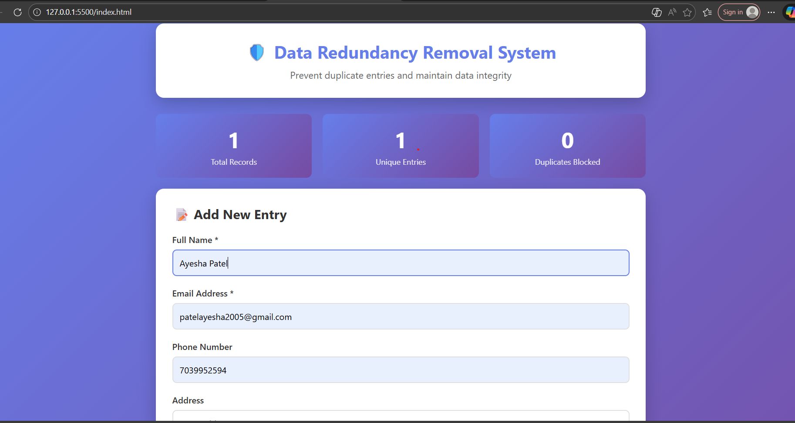

# Data Redundancy Removal System

**CodeAlpha Cloud Computing Internship - Task 1**

## 📖 Project Overview

This project demonstrates a **Data Redundancy Removal System** that prevents duplicate entries in a database. It uses hash-based duplicate detection to ensure data integrity and maintain database accuracy.

## ✨ Features

- ✅ **Smart Duplicate Detection** - Automatically identifies duplicate entries using hash comparison
- ✅ **Real-time Validation** - Validates email format and required fields before submission
- ✅ **Live Statistics Dashboard** - Shows total records, unique entries, and blocked duplicates
- ✅ **User-friendly Interface** - Clean, modern design with responsive layout
- ✅ **Instant Feedback** - Alert notifications for success, errors, and warnings
- ✅ **Data Table View** - Organized display of all stored records with timestamps

## 🎯 How It Works

1. **User enters data** in the form (Name, Email, Phone, Address)
2. **System validates** the input (checks for empty fields, email format)
3. **Hash is generated** by combining Name + Email to create a unique identifier
4. **Duplicate check** - System searches for matching hash in database
5. **Decision made**:
   - If duplicate found → Entry rejected with warning message
   - If unique → Data stored successfully
6. **Display updates** - Statistics and data table refresh automatically

## 🛠️ Technologies Used

- **HTML5** - Structure and content
- **CSS3** - Styling and responsive design
- **JavaScript** - Logic, validation, and duplicate detection
- **Hash Algorithm** - Custom hash function for creating unique data fingerprints

## 📂 Project Structure

```
CodeAlpha_DataRedundancyRemoval/
├── index.html          # Main application file (HTML, CSS, JS combined)
└── README.md          # Project documentation
```

## 🚀 How to Run the Project

### Option 1: Direct Browser Open
1. Download or clone this repository
2. Locate the `index.html` file
3. Double-click to open in your default browser
4. Start testing the duplicate detection!

### Option 2: Using VS Code Live Server
1. Open the project folder in VS Code
2. Install "Live Server" extension
3. Right-click on `index.html`
4. Select "Open with Live Server"
5. Browser opens automatically at `http://127.0.0.1:5500`

## 🧪 Testing Instructions

### Test Case 1: Add Unique Entry
```
Name: John Doe
Email: john@example.com
Phone: 9876543210

Expected Result: ✅ "Data added successfully!"
```

### Test Case 2: Duplicate Detection
```
Re-enter the same Name and Email

Expected Result: ⚠️ "Duplicate Entry Detected!"
```

### Test Case 3: Email Validation
```
Name: Jane Smith
Email: notanemail (invalid format)

Expected Result: ❌ "Please enter a valid email address!"
```

### Test Case 4: Required Fields
```
Leave Name or Email empty and submit

Expected Result: ❌ "Name and Email are required fields!"
```

## 📊 Key Concepts Demonstrated

1. **Data Validation** - Ensuring data quality before processing
2. **Hash-based Deduplication** - Efficient duplicate detection mechanism
3. **Data Integrity** - Maintaining accurate and clean database
4. **User Experience** - Clear feedback through alerts and visual indicators
5. **Frontend Logic** - Client-side data processing and storage

## 🎓 What I Learned

- How to implement duplicate detection algorithms
- Hash generation for data comparison
- Form validation techniques
- DOM manipulation with JavaScript
- Responsive web design principles
- User feedback and error handling

## 🔮 Future Enhancements

- 🔄 Connect to cloud database (MongoDB Atlas/Firebase)
- 🔐 Add user authentication and authorization
- 📤 Export data to CSV/Excel format
- ✏️ Enable edit and delete functionality
- 🔍 Advanced search and filter options
- 📱 Mobile app version
- 🌐 Deploy to cloud platform (AWS/Azure/Heroku)

## 📸 Screenshots

![Project Demo]

screenshot of my working project

## 🎥 Demo Video

Watch the complete project demonstration: [YouTube Link Here]

## 👨‍💻 Author

**[Your Name Here]**  
CodeAlpha Cloud Computing Internship  
Task: Data Redundancy Removal System

## 📧 Contact Information

- 📧 Email: [patelayesha2005@gmail.com]

## 🙏 Acknowledgments

Special thanks to **CodeAlpha** for providing this amazing learning opportunity and hands-on experience in cloud computing and web development.

## 📝 License

This project was created as part of the CodeAlpha Internship Program.


⭐ If you found this project helpful, please give it a star on GitHub!

**Created with ❤️ for CodeAlpha Internship**